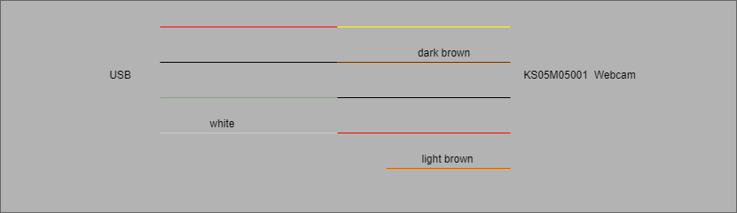
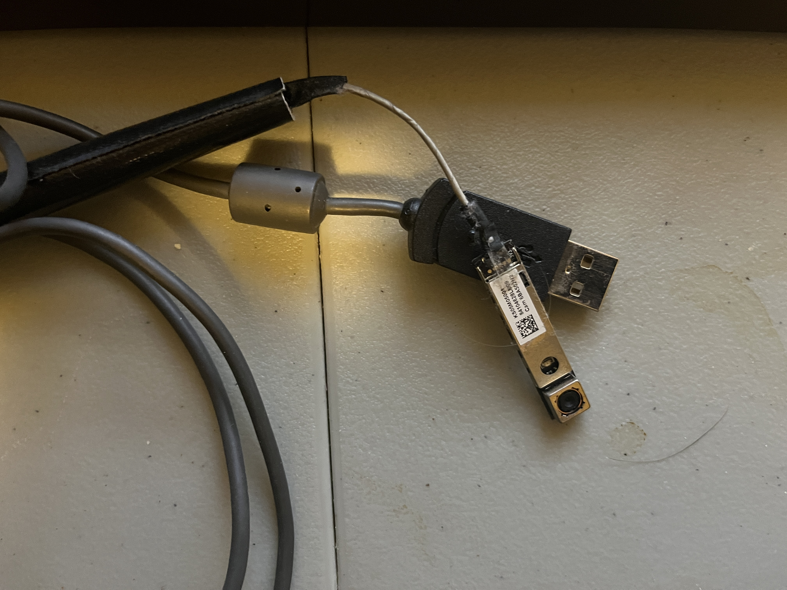

# Homemade-Webcam

When I realized that I needed a webcam for my computer, because I didn't 
have the funds to buy a new one, I decided to build one
using a old laptop webcam.

This was completed using a soldering iron, wire strippers, and duct tape.

<h2>Interface</h2>

<h2>Results</h2>

As of Friday January 20, 2023, the webcam is currently my main
webcam and is mounted on a movable light on my desk.

as of Saturday October 21, 2023, the webcam remains functional
